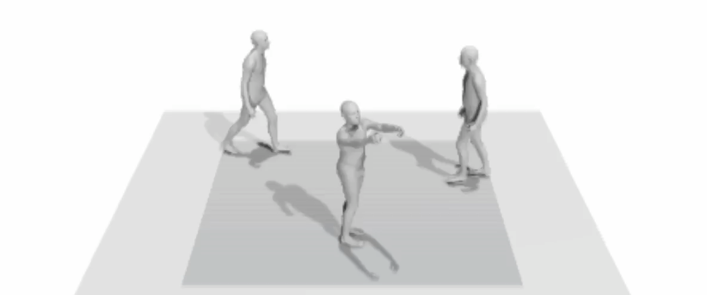

# [ICLR 2023] Stochastic Multi-Person 3D Motion Forecasting



## Introduction


This is the official implementation of "[Stochastic Multi-Person 3D Motion Forecasting](https://arxiv.org/abs/2306.05421)." 

## What's New
* [version 1.0] Code for diffusion-based DuMMF.

## Citation
If you find our code or paper useful, please cite by:
```bibtex
@inproceedings{
    xu2023stochastic,
    title={Stochastic Multi-Person 3D Motion Forecasting},
    author={Xu, Sirui and Wang, Yu-Xiong and Gui, Liangyan},
    booktitle={ICLR},
    year={2023},
}
```
